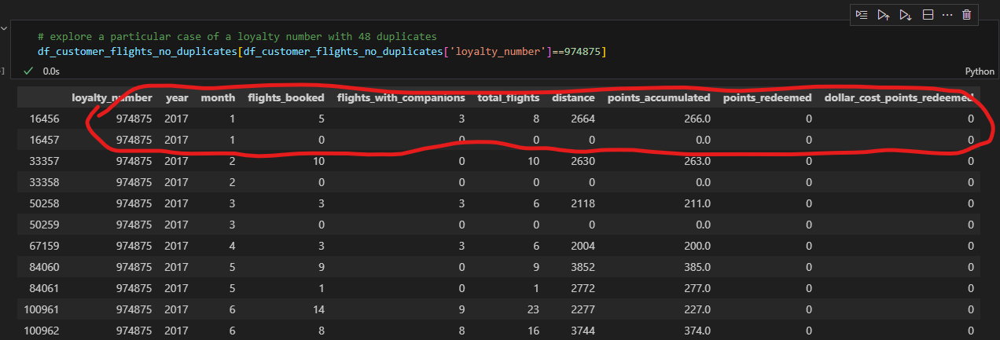

# Conclusions from EDA

Find below the notes based on the EDA results. If there are no comments about some data is because it didn't called my attention.

## DF CUSTOMER FLIGHT (customer_flight_activity.csv)

### General analysis

1. There are 1864 duplicates --> Exploring the results I see that there are two appearances of the same row for 1864 rows. It seems that these duplicated are due to some data error. --> DECISION: KEEP THE FIRST ONLY 

2. Columns data type: las columnas 'Loyalty_number', 'year' and 'month' are numerical. It could be interesting having them as categorical. Keep in mind and change it if needed. --> DECISION: KEEP THEM AS THEY ARE

3. Columns name --> Change format to snake case (good practice)

### Analysis per column

1. Loyalty number column 
    - There are several duplicated values. Those that call my attention are the ones that have more than 24 appearances (more than 24 months). Exploring in more detail I see that there are some duplicates that looks like errors and should be removed as the example in the image below. However, I don't see a way to do this in a straight forward manner, and rather not to lose time with this and continue with the exam. --> DECISION: KEEP THEM AS THEY ARE 

**The rest of the columns of the customer flight dataframe looks OK**

**Summary of transformations to implement** 
- Rename columns to snake case format
- Delete records that are duplicated in all columns keeping only the first appearance

## DF CUSTOMER LOYALTY (customer_loyalty_history.csv)

### General analysis

1. Columns name --> Change format to snake case (good practice)

### Analysis per column

1. Cancellation year and cancelation month comlumns --> 
    - Have 87% of NaN values --> NaN values probably means the customer didn't canceled. --> These could be changed to another value like "Not Cancelled". Doing this will change the column datatype, I don't see an issue with that. --> DECISION: Replace NaN with "Not Cancelled"

2. Salary column
    - There is one salary which is a negative value --> The absolute value is in acordance with the rest of the salaries, so I will consider it as an error and turn it into a positive value. --> DECISION: CHANGE IT TO POSITIVE
    - There are 2488 nulls (25%) --> DECISION: Impute the nulls assigning median

3. Loyalty number column --> Looks fine in this dataframe, there are no duplicates

**Summary of transformations to implement**
- In columns "cancellation_year" and "cancelation_month" replace NaN with "Not Cancelled"
- In salary column transform negative value into positive and impute nulls assigning the median value

